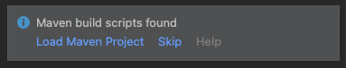

# Oracle Operator Access Control - ITOM Integration (ServiceNow)

## About
See [Oracle blog post on Oracle Operator Access Control (OpCTL) integration with ServiceNow ITOM](https://confluence.oci.oraclecorp.com/display/OPCTL/OpCtl+integration+with+ServiceNow+ITOM).

This solution is based on [Functions Quickstart on Local Host](https://docs.oracle.com/en-us/iaas/Content/Functions/Tasks/functionsquickstartlocalhost.htm), with
a few changes and additions to improve clarity and ease of implementation.
Follow the steps __exactly in the order presented below__.

We recommend local host over CloudShell and OCI Compute as the Dev env for
projects of medium to high complexity. The CloudShell is suitable for simple
demos, but not conducive to iterative development of more complex projects;
OCI Compute requires a lot more setup effort for dev tools and env.

This solution requires the following resources:
1. OCI user account with (access to) tenancy admin privileges.
2. MacOS as the local host OS.
3. IntelliJ IDEA IDE, with Java as the language to implement Functions. 
4. Intermediate knowledge of Containers, OCI, Java, Maven, REST APIs, JSON, and
Terraform.

You can adapt this baseline for other OS (Linux, Windows), languages (Python,
Node, Go, Ruby, C#) and configurations (custom DockerFile, GraalVM) from their
respective documentation.

### Conventions
Key concepts and variable names (prefixed with v_) are shown in *italics*.
OCIDs are shown with their common prefixes followed by "unique_string" for
security. Notes with emphasis are shown in **bold**. OCI Console navigation
is shown with -> for link traversal, starting from hamburger menu. 

## A. Set up your Tenancy
To start with, your user account will be in *v_tenancy_name* in
*v_region_name* (identified by *v_region_identifier* and
*v_region_key*), assigned to a root compartment.

**NOTE**: As a best practice, track all OCI resources in a  as you create them for maintenance, audit and cleanup.

Sign in to the OCI Console at http://cloud.oracle.com as
__tenancy administrator__ (work with your cloud administrator if your account
does not have the privileges).

### A.1. Create Group
Create a group from (Identity & Security -> Groups). Provide *v_group_name*
and create the group. Add *v_user_name* to the group.

### A.2. Create a Compartment (resources owner)
Create a compartment as the child of the root compartment (Identity & Security
-> Compartments -> Create Compartment). We recommend that you create all
resources for the solution under this compartment.

### A.3. Create a VCN for your compartment
The solution has the following networking requirements:
1. Allow the OCI resources to reach an ITOM service endpoint outside the VCN -
   this requires egress to the Internet from the VCN.
2. Allow a client in the ITOM service (say incident dashboard) to access the
   OpCTL web page - this requires ingress into the VCN from the Internet.
3. (Optional) Allow OCI resources to access OCI Services avoiding the Internet -
   this requires *private access* between the subnet and OCI Services Network.

For simplicity, we will assume that you are a creating a new *virtual cloud
network (VCN)* for your project scoped under *v_compartment_name*, and
using a *public subnet* to address requirements #1 and #2. We will review #3
in the [Appendix - Networking](#Appendix-Networking).

(Networking -> Virtual Cloud Networks -> Start VCN Wizard -> Create VCN with
Internet Connectivity -> __Start VCN Wizard__.  __Review__ the network
topology that will be created by the wizard.


Provide the VCN name as *v_vcn_name* and compartment: *v_compartment_name*
(__NOT__ the root compartment).

Accept the defaults provided by the wizard for the following:
- VCN CIDR Block: 10.0.0.0/16
- Public Subnet CIDR Block: 10.0.0.0/24
- Private Subnet CIDR Block: 10.0.1.0/24

Click Next, and __review the resources__ that will be created by the wizard:
1. a *public subnet* with its *security list* and *route table*
2. a *private subnet* with its security list and route table.
3. an *Internet Gateway* for ingress/egress to/from VCN from/to Internet.
4. a *NAT Gateway* for egress to the Internet from the private subnet.
5. a *Service Gateway* for *private access* to the
[Oracle Services Network](https://www.oracle.com/cloud/networking/service-gateway/service-gateway-supported-services/).

Click on Create, and then click on View VCN to review all the component details.
The solution requires only #1 and #3 in the above list. Review the default
ingress and egress rules in the security list, and the route table.

__Do NOT__ change the defaults __unless__ (a) your organization requires it,
and (b) you are familiar with OCI Networking. Secure and clean up the network
configuration once you complete the project end to end. (See
[Appendix - Networking](#Appendix-Networking)).

### A.4. Create OCI policy for group access to OCI features
Create a policy to manage group access for actions on OCI services, scoped
to specific compartments. (Identity & Security -> Policies ->
__Choose the root compartment__ in the left pane -> Create Policy).

Provide *v_policy_name*, add a description, choose the __root compartment
name__ for applicability.  Use the Policy Builder during initial creation:
- For Policy Use cases, select "Functions"
- For Common policy templates, select "Let users create, deploy, and manage
  functions and applications"
- Select *v_group_name* for Group
- Select *v_compartment_name* for Location.

These steps maintain the OCI policy resource under *v_compartment_name*, but
allows applicability of some policy statements across the tenancy.

**IMOPORTANT NOTE**: If customers in regulated environments cannot allow
[these policy statements](https://docs.oracle.com/en-us/iaas/Content/Functions/Tasks/functionsquickstartcloudshell.htm) at
the tenancy level, we must either (a) request tighter controls from Oracle
Functions engineering team, or (b) replace Functions with Events + Notifications
service, given that their policy statements apply only to child compartments.

## B. Set up the local host Dev env
We are using a Mac local host for our solution development and deployment.

### B.1. Set up API Key, OCI Profile, and Auth Token
Configure the local host for OCI access via OCI APIs and the OCI CLI using
steps 1-11 in the [Function Quickstart on Local Host C.2. Set up API
signing key and OCI profile](https://docs.oracle.com/en-us/iaas/Content/Functions/Tasks/functionsquickstartlocalhost.htm) to
create the API key for *v_user_name*.

From a terminal, create the config directory: `mkdir ~/.oci`.  Download the
public and private API key files (with `.pem` extensions) into the `~/.oci`
directory. Copy the default *OCI Profile* provided by the OCI Console with the
following template:
```
[DEFAULT]
user=ocid1.user.oc1..unique_string
fingerprint=aa:bb:cc:dd:ee:ff:gg:hh:ii:jj:kk:ll:mm:nn:oo:pp
tenancy=ocid1.tenancy.oc1..unique_string
region=v_region_identifier
key_file= ... # TO DO
```
Copy the contents into a new file `~/.oci/config` and edit the `key-file=`
entry to `~/.oci/<api_private_key_file_name>.pem`.

Create an **Auth Token** by clicking on Auth Tokens -> Generate Token. Save this
token in `~/.oci/.auth_token`. Use this token later for container login.
to authenticate the Docker Container login to the
[OCI Container Registry](https://docs.oracle.com/en-us/iaas/Content/Registry/Concepts/registryoverview.htm) during function
deployment. Protect the files using `chown og-rwx ~/.oci/config
~/.oci/<api_private_key_file_name>.pem ~/.oci/.auth_token`.

### B.2. Install and Start Container Software
OCI Functions supports Docker and Podman containers. Pick one -
[Podman for MacOS](https://podman.io/getting-started/installation) or
[Docker for MacOS](https://docs.docker.com/desktop/mac/install/).

We chose Docker for this solution, start Docker from the MacOS LaunchPad, run
`docker version && docker run hello-world` from the terminal, and __review
the output__ to see how the container works.

**NOTE**: Podman is a better alternative if you have Oracle Linux (OL) hosts
([Podman for Oracle Linux](https://docs.oracle.com/en/operating-systems/oracle-linux/podman/toc.htm)).
OL8 does not support Docker - the OL team suggested using [CentOS for Docker
instructions](https://docs.docker.com/engine/install/centos/). OL7 is not
listed in Docker documentation; follow [Docker for OL7](https://blogs.oracle.com/virtualization/post/install-docker-on-oracle-linux-7) from Oracle
documentation.

### C.2. Install Dev tools for Dev productivity
Download and install these Dev tools on your local host.
- Install [**Java JDK17 DMG installer for MacOS**](https://www.oracle.com/java/technologies/downloads/#java17).
- **OCI SDK for Java**: and
- **Fn FDK for Java**: Now download and install. Specify package dependencies
  in **pom.xml** (project object model), and let
  [Maven](https://maven.apache.org) resolve them, fetching the libraries from
  CDN'ed repositories worldwide.
- Install
  [IDEA IntelliJ for Mac OS](https://www.jetbrains.com/idea/download/#section=mac)
  for its IntelliSense and built-in Maven.
- **OCI CLI**: helps with troubleshooting. Type
  `brew update && brew install oci-cli` to install OCI CLI, and then  
  `brew list oci-cli && oci --version` to confirm installation.
- **Git**: Install [HomeBrew](https://brew.sh/). Type
  `brew update && brew install fn` to update Git in MacOS, and then
  `brew list git && git --version` to confirm installation.

## C. Set up OCI Function Context

### C.1. Quick Primer - Fn-Project & OCI Function Service
Our solution uses OCI Functions to post data in the customer's ITOM Service
triggered by events from Operator Access Control. This primer summarizes the
essential Functions knowledge for a novice developer, ordered from concepts
to code. OCI Functions and OCI Functions (as a) Service (FaaS) are based on
[Fn-Project's](https://github.com/fnproject/docs/blob/master/fn/general/introduction.md) *Fn* and *Fn Server* components respectively.

**Fn** - is software that helps build *containers* (Docker or Podman) to be
deployed to the *Fn Server* for execution. Each *Function* (upper case F)
is a *container* customized with tools to build functions (lower case 'f')
coded in a language and package the image for deployment to a *Fn Server*.

**Fn Server** - is the service engine that can run anywhere from a local
host to the cloud. It manages and executes Functions.

An *Application* is a service entity for grouping together and managing
multiple *Functions*. When *Fn deploys a Function to an Application on the
Fn Server*, three things happen:

1. Fn builds a *container image* with the function code, and bumps up the
image version.
2. Fn *pushes* the image to a *repository* managed by a *Container Registry*.
3. The Fn Server creates a trigger for the function, so that the Function can
   be *invoked* from various interfaces, for execution by the server.

The *Fn Context* maintains deployment configuration; in particular, a pointer
to the container registry from which Fn can push/pull container images.

The Fn-Project provides the following developer tools:
- *Fn-Project CLI* - the command line interface for Fn (like the OCI CLI)
- *Fn-Project FDK* - Function Development Kit for supported languages
- *Fn-Project API* - this is OCI Function Service API.

We will use the Fn-Project CLI to set up the Fn Context, create, deploy and
invoke OCI Functions, and the FDK for Java in the function code.

### C.2. Create an Application
Create an Application in your project's compartment, from (Developer Services ->
Applications -> Choose *v_compartment_name* -> Create Application).

Provide *v_application_name*. Choose VCN in *v_compartment_name*, and enter
*v_vcn_name*.  Choose Subnets in *v_compartment_name* and choose
"Public Subnet-*v_vcn_name*". From the Application page, follow the link to
create and enable Logs for troubleshooting Functions.

### C.3. Install Fn-Project Command Line Interface (CLI)
Install the Fn-Project CLI for MacOS using [HomeBrew](https://brew.sh/). From
a terminal, type the following to install, check installation.
```
brew update
brew install fn
brew list fn
fn version
fn --help
fn create context --help
fn update context --help
fn init --help
fn deploy --help
fn invoke --help
```
**NOTE**: OCI Functions Quickstart documentation show the smallest footprint
of the above commands. Create the Application from the OCI Console, and use
Fn-Project CLI to manage the rest of objects with more Dev flexibility.

### C.4. Create Fn-Project Context
Create a new Fn Context specifying Oracle as the configuration provider, and
set it as the current context. Then configure the context with:
- the OCI Profile that saved in `~/.oci/config` (with [DEFAULT] tag)
- the compartment that will own the deployed Functions.
- the compartment that will maintain the Function images.
- the Functions Service API endpoint in the same region as the compartment.
- the OCI Container Registry location in the same region as the compartment
- with a repo prefix for the Fn Server to identify images owned by
  *v_compartment_name*.
```
fn create context v_fn_context_name --provider oracle
fn use context v_fn_context_name
fn update context oracle.profile DEFAULT
fn update context oracle.compartment-id v_compartment_ocid
fn update context oracle.image-compartment-id v_compartment_ocid
fn update context api-url https://functions.v_region_identifier.oci.oraclecloud.com
fn update context registry v_region_key.ocir.io/v_tenancy_name/v_repo_name_prefix
```
You can maintain multiple OCI Profiles in `~/.oci/config`, each identified by
unique [PROFILE] labels. Similarly, Fn maintains the configuration in
`~/.fn/config.yaml` and multiple context configuration files under
`~/.fn/contexts`.

## D. Create-Deploy-Invoke Functions
With the local host Dev env, Application and Fn Context in place, you can
now iteratively create, deploy, invoke Functions.

### D.1. Login container to the OCI Container Registry
Login your Docker instance to the OCI Registry to enable Fn access to the OCI
Container Registry, and provide the Auth Token for password. If using Podman,
change the "container-engine-type" entry in `~/.fn/config.yaml` to "Podman"
BEFORE you login.
```
docker login -u 'v_tenancy_name/v_user_name' v_region_key.ocir.io
```
### D.1. Init a Function boilerplate
In preparation for the Operator Control Access - ServiceNow ITOM project, we
will call the Function **opctlitom**. Create the Function boilerplate
under your git-repo-root initialized to a Java runtime.
```
$ cd v_git_repo_root
$ fn init --runtime java opctlitom
Function boilerplate generated.
func.yaml created.
```
The resulting unit of work for the Function is the directory `opctlitom`
containing four files (__Review the file contents__):
- `func.yaml` - the function metadata and a set of properties.
- `pom.xml` - build-deploy-test spec, with JUnit as the test tool.
- `src/main/java/com/example/fn/HelloFunction.java`
- `src/test/java/com/example/fn/HelloFunctionTest.java`

### D.2. Quick Deploy-Invoke Test with HelloFunction
Deploy the Function opctlitom to the Application v_application_name in
the OCI Function Service. __Review the deploy log side by side with pom.xml__.
```
cd v_git_repo_root
fn list apps
fn deploy --verbose --app v_application_name opctlitom \
| tee ~/opctlitom-deploy.log
```
Next, invoke the Function. A `Hello, world!` output will confirm that all
resources are set up correctly to commence the actual integration.
```
fn invoke v_application_name opctlitom
```
## E. Operator Access Control - ServiceNow ITOM Integration
### E.1. Download and install the project files
We will reuse the boilerplate for our project. Backup `func.yaml` and `pom.xml`
to `~/func.yaml.HelloFunction` and `~/pom.xml.HelloFunction`. Download
the files from [OpCTL-ITOM ServiceNow Quickstart](https://github.com/oracle-quickstart/opctl-itom/servicenow), so that the directory has
the updated `func.yaml` and `pom.xml` files, and these new code files.
- `src/main/java/com/opctlitom/fn/OpctlItomRequest.java`
- `src/main/java/com/opctlitom/fn/OpctlItomRequestTest.java`

Since the project files have changed, follow the steps shown above to
build/deploy the Function again. Confirm a successful deployment from
OCI Console -> Developer Services -> Applications -> *v_application_name*

### E.2. Set up Event Rule to trigger Function invoke
To invoke the opctlitom Function forspecific Operator Access Control request
events, create an eventing rule from Observability & Management ->
Events Service -> choose *v_compartment* -> Create Rule, and enter the
following information:
- Display name: opctlitom_events
- Description: Invoke opctlitom Function for Operator Access Control events
- Condition: Event Type
- Service Name: Operator Access Control
- Event Type: Access Request - Approve
- Actions
  - Action type: Functions
  - Function Compartment: *v_compartment_name*
  - Function Application: *v_application_name*
  - Function: **opctlitom**

### E.2. Set up the project in IntelliJ IDEA
Point IntelliJ to the project using File -> New -> Project -> Next ->
Next -> set the Project Location to **opctlitom**. Load Maven Project as
prompted.


Diff the new `func.yaml` and `pom.xml` files against the ones you just
backed up to understand the changes.

Install JDK in the project structure from File -> Project Structure ->
Platform Settings -> SDKs -> Add -> select the JDK17 you had downloaded earlier,
or download the JDK here.

**NOTE**: This is stating the obvious, but an IDE significantly improves your
productivity; for instance, the pom.xml was mostly constructed by IntelliSense
prompting the imports and adding Maven dependencies for unresolved references
in the code that we borrowed from oracle-samples and Quick-start Github. Doing
this manually will have been significantly more effort.

### E.3. Set up ServiceNow endpoint
If you do not have a licensed ServiceNow account, obtain a free ServiceNow
Personal Developer Instance (PDI) by registering
[here](https://developer.servicenow.com) with your corporate email address,
set your profile to Admin to obtain an admin account and password with
an endpoint https://devxxxxx.servicenow.com.

From the Admin Console, choose REST API Explorer and test sample GET, POST, PUT
and DELETE API calls against the endpoint.


We used the POST constructor to determine the schema for the Incidents table,
to translate an Operator Access Control Request to a ServiceNow incident.

### E.4. Secure ServiceNow auth in OCI Vault
The ServiceNow PDI offers Basic authentication for the Service endpoint. Your
production environment may have other alternatives like OAuth. Secure the
secret in the OCI Vault as a key:secret pair using (Identity & Security ->
Vault -> Create Vault -> Choose *v_compartment_name* -> Name:
**opctlitom_vault**).

Create a key by clicking on opctlitom_vault -> Create Key ->
choose *v_compartment_name* -> Name: **opctlitom_vault_key**.

Map the secret to the key by clicking on Secrets -> Create Secret -> choose
*v_compartment_name*, Name: **opctlitom_snow_auth**, description as "ServiceNow
authentication", Encryption key in *v_compartment_name* as
opctlitom_vault_key, and enter the authentication string as the value of the
secret.  Click on the ellipsis on the right of the secret entry in the table,
and copy the secret's OCID.

To access this secret in your program, create a configuration variable in
the Application using Developer Services -> Application -> choose
*v_application_name* -> Configuration.  Add a new configuration
OPCTL_SECRET_OCID and copy the OCID value.

### E.5. OpctlItomRequest.java and handleRequest

### E.6. Summary
Take a moment to review all the items created for this project in the
compartment.
Review all the Fn and OCI objects created for the project so far.
```
fn list contexts
fn list functions v_application_name
docker images
oci search resource structured-search --query-text \
"QUERY all resources where (compartmentId='v_compartment_ocid') && lifeCycleState != 'TERMINATED' && lifeCycleState != 'FAILED'"
```

